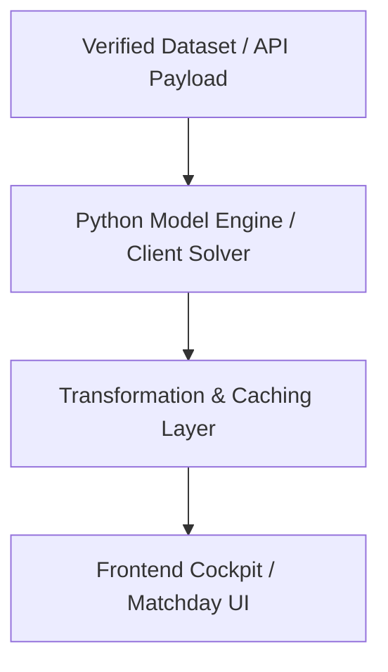

# Technical Architecture & Implementation Plan: [Feature Name]

**Feature ID:** `[slug-identifier]`  
**Specification Reference:** [`spec.md`](spec.md)  
**Status:** `[Draft | Approved | In Execution | Completed]`  
**Lead Engineer / Agent:** `[Name / Agent]`  
**Date:** `YYYY-MM-DD`  

---

## 1. Architectural Overview & Design Decisions

### 1.1 High-Level Architecture
<!-- 
Explain the technical design. How do the components interact? What design patterns are used?
-->



### 1.2 Architectural Decision Records (ADRs)
- **Decision 1**: `[e.g. Run solver client-side in Web Worker to ensure zero server latency and offline capability]`
- **Decision 2**: `[e.g. Cache predictions in localStorage with 15-minute TTL]`

---

## 2. Open Knowledge Format (OKF v0.2) Ground Truth Mapping

Per [CONSTITUTION.md Article II](file:///e:/Fantasy-Premier-League/CONSTITUTION.md), verify and link all relevant knowledge artifacts:

### 2.1 Datasets Consumed or Emitted
- **Schema Reference**: [`knowledge/datasets/players-raw.md`](file:///e:/Fantasy-Premier-League/knowledge/datasets/players-raw.md)
  - Columns used: `[e.g. id, web_name, now_cost, ep_next, selected_by_percent]`
- **Schema Reference**: [`knowledge/datasets/predictions.md`](file:///e:/Fantasy-Premier-League/knowledge/datasets/predictions.md)
  - Columns used: `[e.g. predicted_pts, floor_p10, median_p50, ceiling_p90]`

### 2.2 Mathematical Formulations
- **Model Reference**: [`knowledge/models/points-model.md`](file:///e:/Fantasy-Premier-League/knowledge/models/points-model.md)
  - Invariants: $xP = \sum_{i=1}^{11} C_i$
- **Model Reference**: [`knowledge/models/solver-model.md`](file:///e:/Fantasy-Premier-League/knowledge/models/solver-model.md)
  - Constraints: Selling price formula $\text{selling} = \text{purchase} + \lfloor (\text{current} - \text{purchase})/2 \rfloor$, discount $\gamma = 0.90$

### 2.3 Computation Contracts & Receipts
- **Computation**: [`knowledge/computations/points-prediction-pipeline.md`](file:///e:/Fantasy-Premier-League/knowledge/computations/points-prediction-pipeline.md)
  - Execution Signature: `python model/pipeline_automation.py --season 2026-27 --gw [X]`

---

## 3. Codebase Component & File Map

Group all anticipated code changes by component. Mark files explicitly with `[MODIFY]`, `[NEW]`, or `[DELETE]`.

### 3.1 Backend / Model (`model/` & `scripts/`)
- `[NEW]` [`model/new_module.py`](file:///e:/Fantasy-Premier-League/model/) — Implements `[feature description]`.
- `[MODIFY]` [`model/existing_engine.py`](file:///e:/Fantasy-Premier-League/model/) — Adds `[functionality]`.
- `[NEW]` [`model/test_new_module.py`](file:///e:/Fantasy-Premier-League/model/) — Unit tests covering formulas and edge cases.

### 3.2 Frontend (`frontend/`)
- `[MODIFY]` [`frontend/src/constants/copyTokens.js`](file:///e:/Fantasy-Premier-League/frontend/src/constants/copyTokens.js) — Adds approved copy tokens and badges.
- `[NEW]` [`frontend/src/components/NewComponent.jsx`](file:///e:/Fantasy-Premier-League/frontend/src/components/) — Renders `[feature UI]`.
- `[MODIFY]` [`frontend/src/App.jsx`](file:///e:/Fantasy-Premier-League/frontend/src/App.jsx) — Mounts component into active view.

### 3.3 Documentation & Knowledge (`knowledge/` & `docs/`)
- `[MODIFY]` [`knowledge/index.md`](file:///e:/Fantasy-Premier-League/knowledge/index.md) — Updates OKF catalog if new equations or datasets were added.
- `[MODIFY]` [`JOURNEY.md`](file:///e:/Fantasy-Premier-League/JOURNEY.md) — Logs phase completion and rationale.

---

## 4. State Management & Data Flow

<!-- 
Explain data contracts, state transitions, caching, and reactivity.
-->

1. **Input Payload**: `[Format and validation of incoming data]`
2. **Internal State**: `[How state is stored and transitioned]`
3. **Output Emission**: `[What events or state changes are emitted]`

---

## 5. Resilience, Edge Cases & Graceful Degradation

| Scenario / Edge Case | Failure Mode | Mitigation / Fallback Strategy |
| :--- | :--- | :--- |
| **Network Timeout** | API call hangs or drops | Display cached matchday state with warning badge. |
| **Missing Player Data** | Player absent from `players_raw.csv` | Default to positional league prior ($M_0 = 500\text{ mins}$). |
| **Solver Infeasibility** | Budget exceeded or invalid formation | Fallback to greedy heuristic + show user formation error banner. |

---

## 6. Verification Strategy & Gate Alignment

Execution of the plan must validate each Constitutional Gate:

```bash
# 1. OKF Conformance
python scripts/validate_okf.py

# 2. Voice & Tone Check
npm run check-copy --prefix frontend
pytest model/test_voice_and_tone.py

# 3. Deterministic Attestation
python knowledge/references/attesters/verify_schema.py --season 2026-27 --gw 2
python knowledge/references/attesters/verify_solver.py --season 2026-27 --gw 2

# 4. Automated Tests & Build
pytest
npm run build --prefix frontend
```

---

## 7. Rollback & Migration Plan

- **Rollback Strategy**: If regressions occur during live gameweek operations, revert to `[commit hash / previous release]`.
- **Breaking Changes**: None permitted across public APIs or legacy scraper interfaces.
