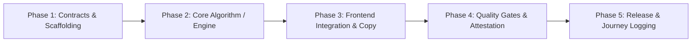

# Implementation Tasks: [Feature Name]

**Feature ID:** `[slug-identifier]`  
**Specification Reference:** [`spec.md`](spec.md)  
**Plan Reference:** [`plan.md`](plan.md)  
**Status:** `[Not Started | In Progress | Ready for Review | Completed]`  
**Assigned Implementer:** `[Name / Agent]`  

---

## Execution Overview & Dependency Sequence



---

## Phase 1: Contracts, Types & Scaffolding

Setup schemas, mock fixtures, and initial test scaffolding before altering business logic.

- [ ] **T-101**: Setup verified test fixtures and baseline assertions.
  - **Target**: `[NEW] model/test_[feature].py`
  - **Verify**: `pytest model/test_[feature].py` (initially failing / red)
- [ ] **T-102**: Register required UI copy strings and strategy badges into copyTokens.
  - **Target**: `[MODIFY] frontend/src/constants/copyTokens.js`
  - **Verify**: `npm run check-copy --prefix frontend`

---

## Phase 2: Core Algorithmic & Backend Implementation

Implement mathematical transformations and data processing in accordance with OKF models.

- [ ] **T-201**: Implement core calculation / pipeline function.
  - **Target**: `[NEW or MODIFY] model/[module].py`
  - **Invariants**: Adhere to $C_1 \dots C_{11}$, Poisson clean sheet, or MILP constraints.
  - **Verify**: `pytest model/test_[feature].py` (now passing / green)
- [ ] **T-202**: Add edge case handling (missing minutes, zero-cost, division by zero).
  - **Target**: `[MODIFY] model/[module].py`
  - **Verify**: `pytest model/test_[feature].py -k "edge_case"`

---

## Phase 3: Frontend UI Integration & Copy Compliance

Build or update React components, ensuring full compliance with the FPL Dugout Voice & Tone Guide.

- [ ] **T-301**: Implement user-facing component using imported copy tokens.
  - **Target**: `[NEW] frontend/src/components/[Component].jsx`
  - **Rule**: Zero raw math formulas or corporate jargon (*assets*, *portfolios*).
  - **Verify**: `npm run check-copy --prefix frontend`
- [ ] **T-302**: Wire component into application state and view router.
  - **Target**: `[MODIFY] frontend/src/App.jsx`
  - **Verify**: Component renders with interactive state in browser.

---

## Phase 4: Mandatory Constitutional Quality Gates

Execute all four gates defined in [CONSTITUTION.md Article VI](file:///e:/Fantasy-Premier-League/CONSTITUTION.md).

- [ ] **T-401 (Gate 1 - OKF Conformance)**:
  - **Verify**: `python scripts/validate_okf.py`
  - **Expected**: 0 errors across knowledge bundle.
- [ ] **T-402 (Gate 2 - Copy & Voice Linter)**:
  - **Verify**: `npm run check-copy --prefix frontend` and `pytest model/test_voice_and_tone.py`
  - **Expected**: 0 violations detected.
- [ ] **T-403 (Gate 3 - Mathematical Attestation)**:
  - **Verify**:
    ```bash
    python knowledge/references/attesters/verify_schema.py --season 2026-27 --gw 2
    python knowledge/references/attesters/verify_solver.py --season 2026-27 --gw 2
    ```
  - **Expected**: All invariants and receipts verified.
- [ ] **T-404 (Gate 4 - Test Suites & Production Build)**:
  - **Verify**:
    ```bash
    pytest
    npm run build --prefix frontend
    ```
  - **Expected**: All tests pass, production bundle builds cleanly.

---

## Phase 5: Documentation & Journey Sign-Off

Finalize audit trails and repository handover notes.

- [ ] **T-501**: Update [JOURNEY.md](file:///e:/Fantasy-Premier-League/JOURNEY.md) with narrative log of changes.
- [ ] **T-502**: Update `spec.md` and `plan.md` status to `Completed`.
