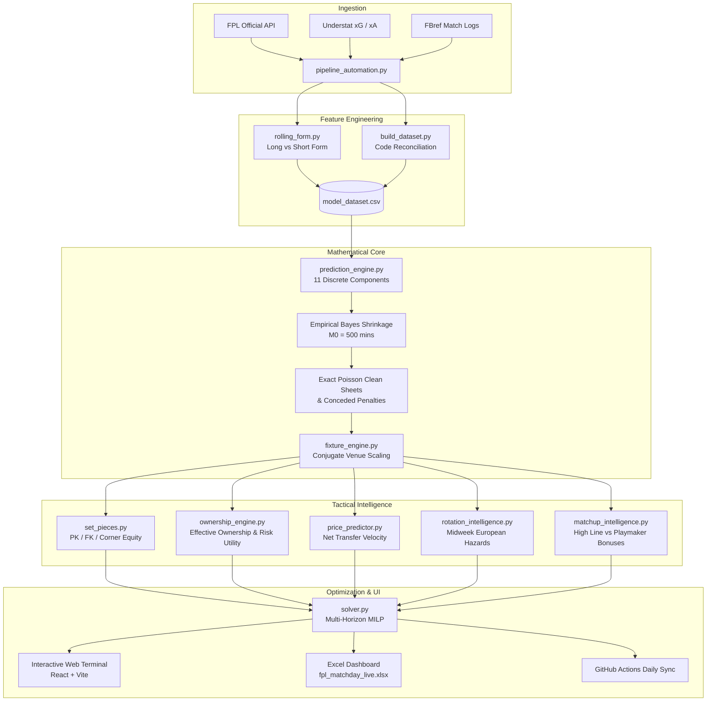

# FPL Intelligence Platform

[](https://frontend-two-eta-z417h3t78v.vercel.app)
[](file:///e:/Fantasy-Premier-League/model/)
[](file:///e:/Fantasy-Premier-League/)
[](file:///e:/Fantasy-Premier-League/data/2026-27/)
[-purple.svg?style=for-the-badge)](file:///e:/Fantasy-Premier-League/model/solver.py)
[](LICENSE)

An open-source quantitative analytics engine, Mixed Integer Linear Programming (MILP) solver, and interactive matchday terminal for Fantasy Premier League.

👉 **[Launch Live Web Terminal (Vercel)](https://frontend-two-eta-z417h3t78v.vercel.app)** · **[GitHub Pages Mirror](https://arabinda07.github.io/Fantasy-Premier-League/)**

---

## Why This Exists

Most Fantasy Premier League managers get trapped in familiar cycles: chasing the player who scored a brace last Saturday, panic-selling on a single blank, or buying into social media hype right before a brutal fixture swing. 

Real football performance is driven by underlying volume and probability:
- A winger underperforming their expected goals ($xG$) across four weeks is usually about to regress positively, not blank forever.
- A center-back facing a high-pressing team with aerial set-piece vulnerabilities offers far more value than standard fixture difficulty ratings suggest.
- A transfer made for Gameweek 2 has downstream consequences for Gameweeks 3, 4, and 5 through banked free transfers and price volatility.

This repository replaces emotional decision-making with a **first-principles mathematical engine**. It breaks player output into 11 discrete scoring distributions, smooths small-sample noise with Empirical Bayes priors, and solves multi-week transfer plans using Mixed Integer Linear Programming (MILP).

---

## The Interactive Web Terminal

The project includes a high-density, dark-mode analytics cockpit under [`frontend/`](file:///e:/Fantasy-Premier-League/frontend/) built with React and Vite:

1. **Tactical Pitch Visualizer**: A 2D field layout rendering your Starting XI in optimal formation (3-4-3, 3-5-2, 4-3-3), complete with Captaincy badges, penalty/corner taker tags (`[PK1]`, `[CK1]`), and an interactive ordered bench. Click any starter and bench asset to simulate substitutions with live points recalculation.
2. **Transfer Hub (3-GW Roadmap)**: A time-expanded transfer workbench tracking upcoming ins/outs, rolling bank balance, and hit penalties across a multi-gameweek horizon. Includes a 600+ player marketplace with instant search, price sliders, and position filters.
3. **38-Gameweek Fixture Heatmap**: All 20 Premier League clubs mapped across every round with official FDR difficulty ratings. Sortable by easiest upcoming attacking runs or best clean sheet potential over 3, 5, 8, or 12 weeks.
4. **11-Component Player DNA Inspector**: Click any player to open a detailed breakdown of their exact scoring probability distributions ($C_1 \dots C_{11}$) alongside underlying Opta/Understat per-90 metrics.
5. **Market Velocity Radar**: A live net transfer tracker ($\Delta T$) flagging imminent price rises (+£0.1M) and drops (-£0.1M), paired with a strategic seasonal chip roadmap for Triple Captain, Bench Boost, and Wildcards.

```bash
# Launch the web terminal locally:
cd frontend
npm install
npm run dev
# Open http://localhost:5173/ in your browser
```

---

## System Architecture



---

## Core Mathematical Models

### 1. The 11-Component Expected Points Framework
Raw points are noisy. Instead of predicting raw totals directly, expected points $\mathbb{E}[\text{Points}]$ are computed across 11 discrete, decoupled football components:

$$\mathbb{E}[\text{Points}] = \sum_{k=1}^{11} C_k$$

| Component | Metric | Formulation |
|:---:|---|---|
| **C1** | Appearance (1–59 mins) | $1.0 \times P(\text{App}) \times (1 - P(60+))$ |
| **C2** | Playing 60+ mins | $2.0 \times P(60+)$ |
| **C3** | Goalkeeper Saves | $\frac{1}{3} \times \text{Saves90} \times \left(\frac{\text{Opp xG90}}{\text{Avg xG}}\right)^{0.65} \times \text{ActiveRatio}$ |
| **C4** | Yellow Cards | $-1.0 \times \max(0, \text{YC90} - 2 \cdot \text{RC90}) \times \text{ActiveRatio}$ |
| **C5** | Red Cards | $-3.0 \times \text{RC90} \times \text{ActiveRatio}$ |
| **C6** | Bonus Point System | $\mathbb{E}[\text{Bonus}] \times (\text{Attack Mult})^{0.75} \times P(\text{Start})$ |
| **C7** | Expected Assists | $3.0 \times (\text{xA90} + \Delta\text{xA}_{\text{Corner}}) \times \text{ActiveRatio}$ |
| **C8** | Expected Goals | $\text{Pts}(\text{Pos}) \times (\text{xG90} + \Delta\text{xG}_{\text{PK}}) \times \text{ActiveRatio}$ |
| **C9** | Clean Sheet Probability | $\text{Pts}(\text{Pos}) \times e^{-\lambda} \times P(60+)$ |
| **C10** | Goals Conceded Penalty | $-\sum_{m=1}^5 m \cdot (P(X = 2m) + P(X = 2m+1)) \times P(60+)$ |
| **C11** | Defensive Action Contribution | Poisson probability of reaching $\ge 10$ or $\ge 15$ recovery/tackle milestones |

---

### 2. Empirical Bayes Prior Shrinkage
Young players and bench substitutes with limited pitch time often post unsustainably high per-90 rates. To prevent small-sample distortion, raw rates are regularized toward positional league baselines:

$$\text{Adjusted Rate} = \frac{M}{M + M_0} \cdot \text{Raw Rate} + \frac{M_0}{M + M_0} \cdot \text{Positional Prior}$$

Where $M_0 = 500.0\text{ minutes}$.

---

### 3. Goal Conservation & Conjugate Venue Symmetry
To ensure mathematical consistency across home and away fixtures:

$$\mathbb{E}[\text{Home Goals Scored}] \equiv \mathbb{E}[\text{Away Goals Conceded}]$$

We enforce exact conjugate venue multipliers:
- **Home Attack Multiplier**: $1.08 \longleftrightarrow$ **Away Defense Multiplier**: $0.9259$
- **Away Attack Multiplier**: $0.9259 \longleftrightarrow$ **Home Defense Multiplier**: $1.08$

---

### 4. Multi-Horizon MILP Squad Optimizer
The optimization module models squad selection as an Integer Linear Program over a 3-to-5 gameweek horizon $H$:

$$\max \sum_{t=1}^H \gamma^{t-1} \left( \sum_{i \in \text{Starters}} x_{i,t} \cdot \text{xP}_{i,t} + \text{xP}_{\text{Captain}, t} - 4.0 \cdot h_t \right)$$

**Key Rules Enforced:**
- **Positional Quotas**: Exactly 2 GK, 5 DEF, 5 MID, 3 FWD.
- **Starting Formation**: Valid starting XI with at least 3 DEF, 2 MID, and 1 FWD.
- **Club Limits**: At most 3 players from any single Premier League team.
- **Selling Price Retention**: Correctly implements FPL's 50% profit retention formula:
  $$\text{Sale Price} = \text{Purchase Price} + \left\lfloor \frac{\text{Current Price} - \text{Purchase Price}}{2} \right\rfloor$$
- **Rolling Free Transfers**: Models transfer accumulation up to 5 banked transfers.

---

## Quick Start & CLI Playbook

### Setup

```bash
git clone https://github.com/Arabinda07/Fantasy-Premier-League.git
cd Fantasy-Premier-League
pip install -r requirements.txt
```

### Daily Live Sync
Fetches the latest official FPL data, records daily price changes, updates injury flags, recalculates 11-component predictions, and solves the optimal squad in ~30 seconds:

```powershell
python -m model.pipeline_automation --season 2026-27 --mode sync
```

### Strategic Solver Runs
Run the optimizer with custom bank balances, free transfer counts, or specific game-theory profiles:

```powershell
# Pure mathematical point maximization:
python -m model.live_manager --season 2026-27 --gw 2 --bank 2.0 --ft 1 --strategy pure_xp

# Hedge against highly owned template captains (Salah/Haaland):
python -m model.live_manager --season 2026-27 --gw 2 --strategy rank_protect

# Hunt low-owned differential picks to climb mini-leagues:
python -m model.live_manager --season 2026-27 --gw 2 --strategy differential_chase
```

### Player Locks & Tactical Overrides
Force specific players into the starting lineup or lock captaincy without breaking overall optimization constraints:

```powershell
python -m model.live_manager --season 2026-27 --gw 2 --lock-players "Haaland,Gabriel" --captain "B.Fernandes"
```

### Multi-Tab Excel Workbook Export
Generates a formatted 5-tab spreadsheet report (`fpl_matchday_live_gw<GW>.xlsx`) with tactical pitch layout, player valuations, and 11-component point breakdowns:

```powershell
python -m model.excel_exporter --season 2026-27 --gw 2 --budget 100.0
```

---

## Autonomous Cloud Sync (GitHub Actions)

A pre-configured GitHub Actions workflow runs every morning at 06:00 UTC in the cloud:
- Pulls live injury news and price changes.
- Re-runs point predictions and optimal transfer paths.
- Commits updated Excel and JSON reports directly back to your repository.

You can also trigger an instant run from your phone or browser at any time via the **Actions** tab on GitHub.

---

## Repository Map

```
Fantasy-Premier-League/
├── frontend/                            # 💻 Interactive Web Analytics Terminal
│   ├── src/
│   │   ├── components/                  # TacticalPitch, TransferWorkbench, FixtureHeatmap, PlayerDNA
│   │   ├── styles/index.css             # High-density obsidian slate design system
│   │   └── App.jsx                      # Main application container
│   └── package.json
├── model/                               # 🧠 Quantitative Core Ecosystem
│   ├── build_dataset.py                 # Feature engineering & Understat/FBref reconciliation
│   ├── rolling_form.py                  # Long vs short-form rolling metrics
│   ├── prediction_engine.py             # 11-component point expectation engine
│   ├── fixture_engine.py                # Conjugate venue scaling & fixture difficulty
│   ├── solver.py                        # Multi-Horizon MILP solver (PuLP/CBC)
│   ├── chip_optimizer.py                # Double/Blank gameweek scanner & chip planner
│   ├── live_manager.py                  # Matchday briefing & decision management
│   ├── excel_exporter.py                # 5-tab formatted Excel report generator
│   ├── pipeline_automation.py           # Automated daily orchestrator & scheduler daemon
│   ├── set_pieces.py                    # Penalty, direct free-kick, and corner taker tracking
│   ├── ownership_engine.py              # Effective Ownership (EO) modeling
│   ├── price_predictor.py               # Net transfer velocity & price rise/drop forecasting
│   ├── rotation_intelligence.py         # Midweek European rotation hazard dampening
│   ├── matchup_intelligence.py          # High-line defense vs playmaker archetype bonuses
│   └── test_*.py                        # 148 automated unit tests (100% passing)
├── data/                                # 📊 10 Seasons of Historical FPL Data
│   ├── 2016-17/ ... 2026-27/            # Season-by-season match logs and player CSVs
│   │   ├── players_raw.csv              # Player season overview stats
│   │   ├── fixtures.csv                 # Complete season schedule & difficulty
│   │   ├── model_dataset.csv            # Engineered modeling feature matrix
│   │   ├── fixture_predictions.csv      # Complete 11-component point projections
│   │   ├── fpl_matchday_live_gw*.xlsx   # Formatted Excel dashboard
│   │   └── fpl_matchday_live_gw*.json   # Live state JSON payload
├── docs/                                # 📑 Engineering Design Specifications
├── DESIGN.md                            # Visual design system & deep module architecture
└── README.md                            # You are here
```

---

## Historical Dataset Archive (2016–2027)

This repository maintains historical Fantasy Premier League data spanning **11 consecutive seasons** (`2016-17` through `2026-27`):

```python
import pandas as pd

# Load historical gameweek records:
url = "https://raw.githubusercontent.com/Arabinda07/Fantasy-Premier-League/master/data/2024-25/gws/merged_gw.csv"
df = pd.read_csv(url)

# Inspect top assets by expected goal involvement (xGI):
print(df[['name', 'GW', 'total_points', 'expected_goals', 'expected_assists']].head())
```

For full column descriptions, refer to [DATA_DICTIONARY.md](DATA_DICTIONARY.md).

---

## Test Suite & Verification

The mathematical models and solver logic are backed by an automated test suite:

```powershell
pytest model/ -v
```

```
============================= test session starts =============================
collected 148 items

model/test_prediction_engine.py .........................                [ 16%]
model/test_fixture_engine.py ............                                [ 25%]
model/test_solver.py .............                                       [ 33%]
model/test_rolling_form.py .............                                 [ 42%]
model/test_excel_exporter.py ....                                        [ 45%]
model/test_multi_horizon.py ..                                           [ 46%]
model/test_chip_optimizer.py ..                                          [ 47%]
model/test_live_manager.py ..                                            [ 49%]
model/test_elite_enhancements.py ....................................... [ 75%]
model/test_matchup_intelligence.py .....................                 [ 89%]
model/test_pipeline_automation.py ..............                         [100%]

==================== 148 passed, 0 failures in 58.90s ====================
```

---

## Citation

If you use this project or dataset in research, modeling work, or sports analytics articles:

```bibtex
@misc{arabinda2026fplengine,
  title = {{FPL Intelligence Platform: Quantitative Point Prediction & Squad Optimization}},
  author = {Arabinda07},
  year = {2026},
  howpublished = {\url{https://github.com/Arabinda07/Fantasy-Premier-League}}
}
```

---

## License

This project is open source under the [MIT License](LICENSE).
