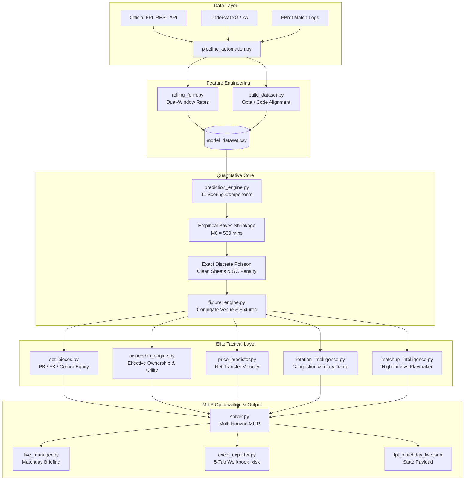

# ⚽ FPL Analytics & Quantitative Intelligence Platform

[](file:///e:/Fantasy-Premier-League/model/)
[](file:///e:/Fantasy-Premier-League/)
[](file:///e:/Fantasy-Premier-League/data/2026-27/)
[-purple.svg?style=for-the-badge)](file:///e:/Fantasy-Premier-League/model/solver.py)
[](LICENSE)

> **Institutional-grade mathematical modeling, Mixed Integer Linear Programming (MILP), and autonomous matchday intelligence for Fantasy Premier League.**

---

## 🌟 Executive Summary: FPL as a Quantitative Hedge Fund

Out of 11 million Fantasy Premier League managers, the vast majority rely on **recency bias, gut feeling, and social media echo chambers** — chasing last week's points, panic-selling assets on a single blank, and falling into price-drop traps.

This platform rebuilds FPL decision-making from first principles, treating squad management like a **quantitative portfolio optimization problem**:

1. **Decomposed Stochastic Point Distributions**: Rather than predicting noisy raw point totals, the engine decomposes expected points into **11 discrete mathematical scoring components ($C_1 \dots C_{11}$)** grounded in Opta/Understat underlying data.
2. **Empirical Bayes Prior Shrinkage**: Small sample sizes (substitute cameos, youth prospects) are regularized toward positional league baselines, eliminating runaway outlier projections.
3. **Multi-Horizon MILP Optimization**: Solves optimal 15-man squad selection, starting XI formations, captaincy, and bench auto-sub hierarchies across a **3-to-5 gameweek lookahead horizon** using temporal discounting ($\gamma = 0.90$) and official FPL 50% profit retention selling price mechanics.
4. **Game-Theoretic Metagame Defense**: Factors in top-10k **Effective Ownership (EO)** to hedge against high-EO talismans or hunt high-ceiling differentials, while monitoring net transfer velocity to capture price rises (+£0.1M) and avoid drops (-£0.1M).
5. **Autonomous Live Pipeline**: An automated, daemon-driven orchestrator that syncs API data, updates live injury dampening, computes price momentum, and generates live matchday decision briefs and executive Excel workbooks.

---

## 🏟️ Live Matchday Command Cockpit Preview

```
==========================================================================================
               FPL LIVE MATCHDAY COMMAND COCKPIT -- 2026-27 GAMEWEEK 2
==========================================================================================
Current Bank: £2.0M | Free Transfers: 1 | Lookahead Horizon: 3 GWs | Strategy: PURE_XP
Optimal Formation: 3-4-3 | Starting XI xP: 60.25 | Total Projected xP: 67.02
Captain: B.Fernandes [C] (+6.77 xP) | Vice-Captain: Haaland [V]
------------------------------------------------------------------------------------------
IMMEDIATE MATCHDAY ACTION: EXECUTE 1 FREE TRANSFER(S): [IN] Cherki | [OUT] Palmer
------------------------------------------------------------------------------------------

STARTING XI LINEUP:
  * DEF | Sessegnon                    (Fulham        ) | 4.69 xP | £ 4.5M (EO: 1%)
  * MID | B.Fernandes [C] [PK1 CK1 FK1](Man Utd       ) | 6.77 xP | £12.0M (EO: 91%)
  * FWD | Nmecha                       (Leeds         ) | 5.41 xP | £ 5.5M (EO: 1%)
  * MID | Tavernier       [CK1 FK1]    (Bournemouth   ) | 5.46 xP | £ 6.0M (EO: 3%)
  * GK  | Raya                         (Arsenal       ) | 5.04 xP | £ 6.0M (EO: 59%)
  * MID | Cherki          [CK1 FK1]    (Man City      ) | 5.35 xP | £ 7.5M (EO: 13%)
  * DEF | Calafiori                    (Arsenal       ) | 4.85 xP | £ 5.5M (EO: 54%)
  * FWD | Awoniyi                      (Coventry City ) | 5.43 xP | £ 5.5M (EO: 1%)
  * DEF | Gabriel                      (Arsenal       ) | 5.65 xP | £ 8.0M (EO: 50%)
  * MID | Reed                         (Fulham        ) | 5.35 xP | £ 4.5M (EO: 2%)
  * FWD | Haaland [V]     [PK1]        (Man City      ) | 6.26 xP | £15.5M (EO: 121%)

ORDERED BENCH:
  * Slot 1 (GK)     | GK  | Woodman            (Liverpool     ) | 3.94 xP | £ 4.0M
  * Slot 2 (Sub 1)  | MID | Longstaff          (Leeds         ) | 4.48 xP | £ 5.0M (1st Priority)
  * Slot 3 (Sub 2)  | DEF | Robinson           (Fulham        ) | 4.36 xP | £ 4.5M (2nd Priority)
  * Slot 4 (Sub 3)  | DEF | Davies             (Spurs         ) | 3.76 xP | £ 4.0M (3rd Priority)

------------------------------------------------------------------------------------------
MULTI-GAMEWEEK TRANSFER ROADMAP:
------------------------------------------------------------------------------------------
  * GW2: IN: Cherki                    | OUT: Palmer               | Projected xP: 67.02 | Bank: £2.0M
  * GW3: IN: Osula                     | OUT: Nmecha               | Projected xP: 67.08 | Bank: £1.5M
  * GW4: IN: Senesi                    | OUT: Robinson             | Projected xP: 66.26 | Bank: £0.0M
==========================================================================================
```

---

## 🏗️ System Architecture & Data Flow



---

## 📐 Mathematical Formulation Highlights

### 1. The 11-Component Expected Points Theorem
Total projected points $\mathbb{E}[\text{Points}]$ are computed across 11 discrete, mathematically decoupled scoring components:

$$\mathbb{E}[\text{Points}] = \sum_{k=1}^{11} C_k$$

| Component | Description | Mathematical Formulation |
|:---:|---|---|
| **$C_1$** | Appearance (1–59 mins) | $1.0 \times P(\text{App}) \times (1 - P(60+))$ |
| **$C_2$** | Playing 60+ mins | $2.0 \times P(60+)$ |
| **$C_3$** | Goalkeeper Saves | $\frac{1}{3} \times \text{Saves90} \times \left(\frac{\text{Opp\_xG90}}{\text{League\_Avg\_xG}}\right)^{0.65} \times \text{ActiveRatio}$ |
| **$C_4$** | Disciplinary (Yellow Cards) | $-1.0 \times \max(0, \text{yc90} - 2 \cdot \text{rc90}) \times \text{ActiveRatio}$ |
| **$C_5$** | Disciplinary (Red Cards) | $-3.0 \times \text{rc90} \times \text{ActiveRatio}$ |
| **$C_6$** | Bonus Points | $\mathbb{E}[\text{Bonus}] \times \text{Attack\_Mult}^{0.75} \times P(\text{Start})$ |
| **$C_7$** | Expected Assists | $3.0 \times (\text{xA90} + \Delta\text{xA}_{\text{Corners}}) \times \text{ActiveRatio}$ |
| **$C_8$** | Expected Goals | $\text{Pts}(\text{Pos}) \times (\text{xG90} + \Delta\text{xG}_{\text{PK}}) \times \text{ActiveRatio}$ |
| **$C_9$** | Clean Sheet Probability | $\text{Pts}(\text{Pos}) \times e^{-\lambda_{\text{match}}} \times P(60+)$ |
| **$C_{10}$** | **Exact Discrete Goals Conceded Penalty** | $-\sum_{m=1}^5 m \cdot \left(P(X = 2m) + P(X = 2m+1)\right) \times P(60+)$ |
| **$C_{11}$** | Defensive Contribution (DC) | Poisson probability of reaching $\ge 10$ or $\ge 15$ defensive actions |

---

### 2. Empirical Bayes Prior Shrinkage
To prevent small-sample players (e.g. 150 minutes with 1 outlier goal) from projecting unsustainable elite rates, raw per-90 rates are shrunk toward positional league baselines:

$$\text{rate}_{\text{adj}} = \frac{M}{M + M_0} \cdot \text{rate}_{\text{raw}} + \frac{M_0}{M + M_0} \cdot \text{Prior}(\text{Position})$$

Where $M_0 = 500.0\text{ minutes}$.

---

### 3. Conjugate Venue Symmetry & Goal Conservation
To ensure mathematical conservation between attacking strength and defensive concessions across the league:

$$\mathbb{E}[\text{Goals Scored}_{\text{Home}}] \equiv \mathbb{E}[\text{Goals Conceded}_{\text{Away}}]$$

We formulate exact conjugate venue pairs:
$$\text{Home Attack} = 1.08 \longleftrightarrow \text{Away Defense} = \frac{1}{1.08} = 0.9259$$
$$\text{Away Attack} = 0.9259 \longleftrightarrow \text{Home Defense} = 1.08$$

---

### 4. Multi-Horizon MILP Formulation
The optimization engine solves a time-expanded Mixed Integer Linear Program across horizon $H \in \{3, 4, 5\}$ gameweeks:

$$\max \sum_{t=1}^H \gamma^{t-1} \left( \sum_{i \in \text{Starters}} x_{i,t} \cdot \text{xP}_{i,t} + \text{xP}_{\text{Captain}, t} - 4.0 \cdot h_t \right)$$

**Subject to:**
- **Positional Quotas**: Exactly 2 GK, 5 DEF, 5 MID, 3 FWD ($S_{t} = 15$).
- **Formation Constraints**: Valid starting XI satisfying $\ge 3$ DEF, $\ge 2$ MID, $\ge 1$ FWD.
- **Club Limits**: $\sum_{i \in \text{Team}_k} s_{i,t} \le 3$ for all 20 Premier League clubs.
- **Inter-Temporal Squad Continuity**: $s_{i,t} = s_{i,t-1} + u_{i,t} - v_{i,t}$
- **Official FPL Selling Price Mechanics**:
  $$\text{Sale Price} = \text{Purchase Price} + \left\lfloor \frac{\text{Current Price} - \text{Purchase Price}}{2} \right\rfloor$$
- **Rolling Free Transfer Banking**: Free transfers accumulate from 1 up to 5 ($FT_t = \min(5, FT_{t-1} - \text{transfers}_t + 1)$).

---

## 🚀 Quick Start & CLI Playbook

### Installation

```bash
# 1. Clone your repository:
git clone https://github.com/Arabinda07/Fantasy-Premier-League.git
cd Fantasy-Premier-League

# 2. Install dependencies:
pip install -r requirements.txt
```

---

### Key Commands

#### 1. Fast Daily Pipeline Sync (Recommended Pre-Deadline)
Fetches official FPL API, tracks daily price change velocity, updates injury news, computes 11-component predictions, and solves the optimal matchday squad in ~30 seconds:
```powershell
python -m model.pipeline_automation --season 2026-27 --mode sync
```

#### 2. Live Matchday Solver with Strategic Customization
Customize your bank, free transfers, lookahead horizon, and game theory risk profile:
```powershell
# Neutral expected points:
python -m model.live_manager --season 2026-27 --gw 2 --bank 2.0 --ft 1 --horizon 3 --strategy pure_xp

# Protect high rank against template talismans:
python -m model.live_manager --season 2026-27 --gw 2 --strategy rank_protect

# Hunt low-owned differentials to climb mini-leagues:
python -m model.live_manager --season 2026-27 --gw 2 --strategy differential_chase
```

#### 3. Tactical Player Locks & Captain Overrides
Force specific players into your lineup or exclude certain assets without breaking global MILP optimality:
```powershell
python -m model.live_manager --season 2026-27 --gw 2 --lock-players "Haaland,Gabriel" --captain "B.Fernandes"
```

#### 4. Autonomous Scheduler Daemon
Run the pipeline continuously in the background (e.g. every 6 hours):
```powershell
python -m model.pipeline_automation --season 2026-27 --daemon --interval-hours 6
```

#### 5. Generate Multi-Tab Executive Excel Report
Exports a formatted 5-tab workbook (`fpl_matchday_live_gw<GW>.xlsx`) with KPI cards, tactical pitch layout, and 11-component player breakdowns:
```powershell
python -m model.excel_exporter --season 2026-27 --gw 2 --budget 100.0
```

---

## 📁 Repository Structure

```
Fantasy-Premier-League/
├── model/                               # 🧠 Quantitative Core Ecosystem
│   ├── build_dataset.py                 # Feature engineering & Understat/FBref reconciliation
│   ├── rolling_form.py                  # Dual-window rolling form (long-form & short-form)
│   ├── prediction_engine.py             # 11-component expected points expectation engine
│   ├── fixture_engine.py                # Conjugate venue scaling & fixture difficulty
│   ├── solver.py                        # Multi-Horizon MILP solver (PuLP/CBC)
│   ├── chip_optimizer.py                # DGW/BGW scanner & seasonal chip deployment plan
│   ├── live_manager.py                  # Matchday command cockpit & decision briefs
│   ├── excel_exporter.py                # 5-tab executive Excel workbook generator
│   ├── pipeline_automation.py           # Master automated orchestrator & scheduler daemon
│   ├── set_pieces.py                    # Official PK / Direct FK / Corner taker hierarchy
│   ├── ownership_engine.py              # Effective Ownership (EO) modeling & risk utility
│   ├── price_predictor.py               # Net transfer velocity & ±£0.1M price change alerts
│   ├── rotation_intelligence.py         # Midweek European congestion & sub-60min hazards
│   ├── matchup_intelligence.py          # High-line defense vs playmaker archetype bonuses
│   ├── backtester.py                    # Historical backtesting simulation engine
│   └── test_*.py                        # 148 automated unit tests (100% passing)
├── data/                                # 📊 10 Seasons of Historical FPL Data
│   ├── 2016-17/ ... 2026-27/            # Season-by-season granular player & match CSVs
│   │   ├── players_raw.csv              # Full player overview stats
│   │   ├── fixtures.csv                 # Season schedule & difficulty ratings
│   │   ├── teams.csv                    # Team information & strengths
│   │   ├── model_dataset.csv            # Engineered modeling feature matrix
│   │   ├── fixture_predictions.csv      # Full 11-component point projections
│   │   ├── fpl_matchday_live_gw*.xlsx   # Executive Excel dashboard
│   │   ├── fpl_matchday_live_gw*.json   # Live JSON state payload
│   │   └── gws/merged_gw.csv            # Gameweek-by-gameweek match logs
├── docs/                                # 📑 Specifications & Architecture Documentation
│   ├── superpowers/specs/               # Phase-by-phase engineering design specifications
│   └── HANDOVER_AND_ROADMAP.md          # Transition playbooks & roadmap
├── global_scraper.py                    # Legacy top-level FPL scraper orchestration
├── collector.py                         # Gameweek CSV merge utilities
├── understat.py                         # Understat scraper & ID matching
├── fbref.py                             # FBref match log scraper
├── getters.py / parsers.py              # Shared FPL REST API parsers
├── positions.py                         # Positional mapping source of truth
├── JOURNEY.md                           # Comprehensive engineering & lessons-learned log
└── README.md                            # You are here
```

---

## 📊 Historical Dataset Archive (2016–2027)

This repository preserves the complete, widely-cited historical Fantasy Premier League dataset spanning **11 consecutive seasons** (`2016-17` through `2026-27`):

### Accessing Data via Python / Pandas

```python
import pandas as pd

# Load historical gameweek records:
url = "https://raw.githubusercontent.com/Arabinda07/Fantasy-Premier-League/master/data/2024-25/gws/merged_gw.csv"
df = pd.read_csv(url)

# Inspect top performers by expected goal involvement (xGI):
print(df[['name', 'GW', 'total_points', 'expected_goals', 'expected_assists']].head())
```

For complete field definitions, consult the [DATA_DICTIONARY.md](DATA_DICTIONARY.md).

---

## 🛡️ Verification & Test Suite

The quantitative engine is thoroughly covered by an automated `pytest` test suite:

```powershell
pytest model/ -v
```

```
============================= test session starts =============================
collected 148 items

model/test_prediction_engine.py .........................                [ 16%]
model/test_fixture_engine.py ............                                [ 25%]
model/test_solver.py .............                                       [ 33%]
model/test_rolling_form.py .............                                 [ 42%]
model/test_excel_exporter.py ....                                        [ 45%]
model/test_multi_horizon.py ..                                           [ 46%]
model/test_chip_optimizer.py ..                                          [ 47%]
model/test_live_manager.py ..                                            [ 49%]
model/test_elite_enhancements.py ....................................... [ 75%]
model/test_matchup_intelligence.py .....................                 [ 89%]
model/test_pipeline_automation.py ..............                         [100%]

==================== 148 passed, 0 failures in 58.90s ====================
```

---

## 🔮 Upcoming Roadmap: The Web Command Cockpit

We are actively developing a **modern, high-performance web dashboard (React/Vite)** to turn this backend into your interactive matchday command center:

- 🏟️ **Tactical Pitch Visualizer**: Interactive glassmorphic pitch with real-time xP badges, FDR meters, and drag-and-drop substitutions.
- 🔄 **Multi-Horizon Transfer Workbench**: Visual 3–5 GW transfer planner with instant bank math and selling-price profit calculations.
- 🗺️ **38-Gameweek Fixture Heatmap**: Dynamic sortable matrix highlighting attacking and defensive green fixture swings.
- 🔬 **11-Component Player Deconstructor**: Stacked breakdown and radar charts for every point component ($C_1 \dots C_{11}$).

---

## 📜 Citation & Academic Use

If you use this codebase or dataset in research, modeling competitions, or analytics publications:

```bibtex
@misc{arabinda2026fplengine,
  title = {{FPL Analytics & Quantitative Intelligence Platform}},
  author = {Arabinda07},
  year = {2026},
  howpublished = {\url{https://github.com/Arabinda07/Fantasy-Premier-League}}
}
```

---

## 📄 License

This project is licensed under the [MIT License](LICENSE).
