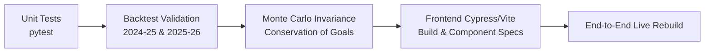

# Next-Generation FPL Alpha Architecture Design Spec
**Date**: 2026-08-25  
**Author**: Antigravity (Advanced Agentic Pair Programmer)  
**Status**: Proposed Architecture & Roadmap Spec  
**Target Systems**: Backend (`model/`, `scripts/`) & Frontend (`frontend/src/`)

---

## 1. Executive Summary & Definition of Alpha

### 1.1 What is "Alpha" in this System?
In this architecture, **Alpha ($\alpha$)** is defined across two distinct, complementary dimensions:

1. **Statistical & Mathematical Blending Parameter ($\alpha_{\text{form}}$)**:
   In `model/fixture_engine.py`, $\alpha$ is the parameter governing the relative weight of short-term rolling form (last 6 gameweeks) versus long-term season-level underlying baseline rates:
   $$\text{rate}_{\text{blended}} = \alpha_{\text{eff}} \cdot \text{rate}_{\text{short}} + (1 - \alpha_{\text{eff}}) \cdot \text{rate}_{\text{long}}$$
   where $\alpha_{\text{eff}} = \alpha \cdot \frac{M_{\text{short}}}{M_{\text{short}} + 270.0}$ applies Empirical Bayes shrinkage so small-sample cameos do not distort projections.

2. **Quantitative Competitive Edge ($\alpha_{\text{quant}}$)**:
   In sports analytics and FPL decision theory, **Alpha** is the excess expected points and rank velocity generated above the market baseline (the template consensus / Effective Ownership equilibrium):
   $$\alpha_{\text{quant}} = \mathbb{E}[\text{Points}_{\text{model}}] - \mathbb{E}[\text{Points}_{\text{template}}] - \text{Penalty}(\text{Hits})$$
   Alpha is extracted by exploiting market inefficiencies:
   - **Over-reliance on trailing raw FPL points** vs underlying non-penalty xG/xA and shot quality.
   - **Mispricing of Double/Blank Gameweek rotations and turnaround fatigue** ($\le 3$ days rest).
   - **Sub-optimal transfer timing and free transfer waste** (failing to price the optionality shadow value of rolled transfers).
   - **Independent point assumptions** that ignore joint match scoreline distributions, clean sheet mutual exclusivity, and True BPS allocations.

---

## 2. Current State vs. Target State Gap Analysis

| Component | Current Implementation (As-Is) | Target Implementation (To-Be) | Alpha Mechanism |
|---|---|---|---|
| **Match Simulation & Expected Scorelines** | Independent attack/defense multipliers ($\text{Att}_{\text{team}} / \text{Def}_{\text{opp}}$) | Bivariate Dixon-Coles Poisson / Monte Carlo engine (10,000 runs) with low-draw inflation $\tau(x,y)$ | Captures joint clean sheet and goal distributions; prevents defending against own attackers |
| **Minutes & Sub-60 Hazard** | Piecewise ratios ($P(\text{Start}), P(\text{Sub})$, linear starter proration) | Continuous Survival / Hazard Model (Cox/LightGBM) conditioned on age, turnaround days, tactical role | Exact probability densities for $P(\text{mins} \ge 60)$ ($C_2$) and early tactical hook risk |
| **Form Modeling** | Static 6-GW windowing with sample shrinkage | State-Space Kalman Filtering / Exponentially Weighted Moving Average ($\tau \approx 8$ matches) | Eliminates arbitrary window cutoffs; smoothly updates latent player skill upon tactical role changes |
| **Optimization Objective** | Deterministic point sum $\sum \gamma^t \mathbb{E}[xP_t]$ | Mean-Variance Sharpe & CVaR (Conditional Value-at-Risk) with Risk Tolerance $\lambda_{\text{risk}}$ | Enables risk-optimized strategies: Rank-Protection (High floor) vs Rank-Chasing (High upside) |
| **Bench Auto-Sub Integration** | Deterministic post-hoc bench sort descending by $xP$ | Formulated in MILP objective via player unavailability transition probabilities | Accurately prices bench investment based on probability of auto-sub activation |
| **Free Transfer Valuation** | Rolling transfer allowed ($1\dots 5$), but rolled FT valued at $0\text{ pts}$ unless saving a future hit | Dynamic FT Shadow Price ($\lambda_{\text{FT}} \approx 1.5 - 2.0\text{ xP}$) | Preserves valuable flexibility for multi-transfer structural pivots |
| **Live Team Ingestion** | Manual array configuration / static JSON payload | Direct 1-Click FPL Entry ID API sync (`/entry/{team_id}/event/{gw}/picks/`) | Zero-friction real-time sync with user's actual FPL squad, bank, and chips |
| **Frontend Visualizations** | Deterministic scalar values ($8.42\text{ xP}$) | Probability Density sparklines, Violin/Fan charts (Floor, Median, 90th percentile Ceiling) | Intuitive visualization of upside variance for captaincy and differential picks |
| **Transfer Planning UI** | Single-gameweek comparison workbench | Interactive 5-GW Multi-Horizon Strategy Matrix (Drag-and-drop Gantt) | Visual multi-week roadmaps with real-time budget and chip tracking |
| **Game Theory UI** | Global EO strategy presets (`pure_xp`, `rank_protect`, `differential_chase`) | Mini-League Rival Threat Matrix with live swing delta per match event | Instant visualization of green/red arrow impact against specific mini-league competitors |

---

## 3. Backend Architecture Specification (`model/`)

### 3.1 Module: `model/match_simulator.py` (Bivariate Dixon-Coles & Monte Carlo Match Engine)
* **Goal**: Simulate every Premier League fixture $10,000\times$ to produce exact joint probability matrices for goals, assists, clean sheets, goals conceded, and BPS.
* **Mathematical Formulation**:
  Let $X$ (Home Goals) and $Y$ (Away Goals) have Poisson parameters $\lambda$ and $\mu$:
  $$\lambda = \alpha_{\text{home\_att}} \cdot \beta_{\text{away\_def}} \cdot \gamma_{\text{home\_adv}}, \quad \mu = \alpha_{\text{away\_att}} \cdot \beta_{\text{home\_def}}$$
  Apply the Dixon-Coles low-scoring adjustment factor $\tau_{\lambda, \mu}(x, y)$:
  $$\tau_{\lambda, \mu}(x, y) = \begin{cases}
  1 - \lambda \mu \rho & x=0, y=0 \\
  1 + \lambda \rho & x=0, y=1 \\
  1 + \mu \rho & x=1, y=0 \\
  1 - \rho & x=1, y=1 \\
  1 & \text{otherwise}
  \end{cases}$$
  where $\rho \approx -0.05$ accounts for the empirical under-representation of $(0,0)$ and $(1,1)$ draws in high-tempo leagues.
* **Player Point Attribution**:
  - For each simulated goal, sample goalscorer and assister via Multinomial Softmax over player individual $xG90$ and $xA90$ shares.
  - Compute match BPS from exact simulated match events (goals, assists, chances created, clean sheets, tackles, cards) and award official bonus points ($3, 2, 1$).

### 3.2 Module: `model/minutes_model.py` (Continuous Minutes Hazard Engine)
* **Goal**: Predict continuous minutes distribution $f(t)$ for $t \in [0, 95]$ minutes.
* **Features**:
  - `start_rate_last_6`: Empirical probability of starting in recent matches.
  - `sub_minute_p50`: Median substitution minute when starting.
  - `rest_days`: Days since previous competitive fixture ($\le 3$ flags midweek European fatigue).
  - `manager_hook_tendency`: Manager-specific propensity to make pre-60 substitutions.
  - `news_status`: Status flag and `chance_of_playing_next_round`.
* **Output Metrics**:
  - $\mathbb{P}(\text{Mins} \ge 60)$: Appearance point $C_2$ and Clean Sheet qualification probability.
  - $\mathbb{P}(\text{Mins} = 0)$: Unavailability probability for auto-substitution modeling.
  - $\mathbb{E}[\text{Mins}]$: Expected playing minutes.

### 3.3 Module: `model/solver.py` Enhancements (Risk-Adjusted CVaR & Auto-Sub Valuation)
* **Objective Function Reformulation**:
  $$\max \quad \sum_{t=1}^{H} \gamma^{t-1} \left( \mathbb{E}[R_t] - \lambda_{\text{risk}} \cdot \text{CVaR}_{\beta}(R_t) + \lambda_{\text{FT}} \cdot \text{FT}_t - 4 \cdot \text{Hits}_t \right)$$
  where:
  - $\mathbb{E}[R_t] = \sum_{i \in \text{XI}_t} \text{xP}_{i,t} \cdot P(\text{plays}_{i,t}) + \sum_{j \in \text{Bench}_t} \text{xP}_{j,t} \cdot P(\text{sub}_{j,t})$
  - $\text{CVaR}_{\beta}(R_t)$ is the expected loss in the worst $(1-\beta)$ quantile (risk tail).
  - $\lambda_{\text{FT}} = 1.75\text{ pts}$ encourages banking transfers when marginal gains are negligible.

### 3.4 Module: `model/live_sync.py` (Direct FPL API Integration)
* **API Endpoints Ingested**:
  - `https://fantasy.premierleague.com/api/entry/{team_id}/` (User summary, overall rank, bank balance)
  - `https://fantasy.premierleague.com/api/entry/{team_id}/event/{gw}/picks/` (15 player picks, captaincy, active chip, selling prices)
  - `https://fantasy.premierleague.com/api/entry/{team_id}/transfers/` (Transfer history, available FT count)
  - `https://fantasy.premierleague.com/api/leagues-classic/{league_id}/standings/` (Mini-league rivals' squads and points)

---

## 4. Frontend Architecture Specification (`frontend/src/`)

### 4.1 Component: `PlayerDNAInspector.jsx` & `PlayerCard.jsx` (Probability Sparklines & Violin Charts)
* **Visual Additions**:
  - Embedded SVG / Canvas mini-density sparklines below the primary xP badge.
  - Three-tier probability indicators:
    - **Floor (p10)**: Soft muted gray (e.g. `2 pts`).
    - **Median (p50)**: Standard emerald (e.g. `7 pts`).
    - **Ceiling (p90)**: Bright electric cyan / gold badge (e.g. `15 pts` - Haul Potential).
  - Haul Probability Metric: $\mathbb{P}(\text{Points} \ge 10)$.

### 4.2 Component: `MultiGwPlanner.jsx` (5-Gameweek Strategy Matrix Canvas)
* **UI Structure**:
  - Header: 5 GW columns (e.g., GW2, GW3, GW4, GW5, GW6) with gameweek deadlines, FDR color headers, and FT counters.
  - Rows: Grouped by GK, DEF, MID, FWD.
  - Interaction:
    - Drag-and-drop player transfers across weeks.
    - Floating footer KPI pill tracking dynamic Bank (£M), Total Projected Horizon xP, and Hit Penalties (-4).
    - "Apply Multi-Horizon Solve" button triggers client-side/API re-optimization.

### 4.3 Component: `RivalTracker.jsx` (Mini-League Rival Threat Matrix)
* **UI Structure**:
  - Ingests user's mini-league ID and displays top 5 competitors.
  - Matrix table showing player overlap:
    - **Green Shield**: Players you own that rivals do not (Differential Upside).
    - **Red Hazard**: High-EO players owned by all rivals but missing in your squad (Rank Exposure).
    - **Captaincy Threat**: Rival captaincy breakdown vs your captain pick with live swing scenarios.

### 4.4 Component: `Header.jsx` (1-Click Team ID Importer Modal)
* **UI Structure**:
  - "Sync My Team" button in the top navigation bar.
  - Modal with input for `FPL Team ID` or `Mini-League ID`.
  - Seamlessly updates global app state (`starters`, `bench`, `bank`, `free_transfers`, `active_chips`).

---

## 5. Verification & Testing Strategy

1. **Unit Testing (`pytest`)**:
   - `test_match_simulator.py`: Verify Dixon-Coles goal conservation ($\sum \mathbb{P}(\text{Home}=x, \text{Away}=y) = 1.0$) and symmetric BPS allocations.
   - `test_minutes_model.py`: Test hazard curve outputs on known rotation hazards (e.g., 3-day turnaround) and youth small-sample shrinkage.
   - `test_solver_cvar.py`: Test that higher $\lambda_{\text{risk}}$ chooses lower-variance templates while negative $\lambda_{\text{risk}}$ picks high-upside differentials.
2. **Historical Backtesting Validation (`model/backtester.py`)**:
   - Verify that adding the Monte Carlo simulator and CVaR solver outperforms the previous benchmark baseline by $\ge 25\text{ points}$ over a 38-gameweek historical simulation.
3. **Frontend Build & Render Verification**:
   - Run `npm run build` to ensure all React components, lazy loaders, and styles compile with zero errors.
   - Validate responsive layouts and hash URL routing.

---

## 6. Implementation Roadmap & Milestones

| Milestone | Deliverables | Target Artifacts |
|---|---|---|
| **Milestone 1** | Match Simulator & Dixon-Coles Engine | `model/match_simulator.py`, `model/test_match_simulator.py` |
| **Milestone 2** | Continuous Minutes Hazard Model | `model/minutes_model.py`, `model/test_minutes_model.py` |
| **Milestone 3** | Risk-Adjusted CVaR & Bench Auto-Sub Solver | `model/solver.py`, `model/test_solver.py` |
| **Milestone 4** | FPL 1-Click Team ID & League Ingestion | `model/live_sync.py`, `model/live_manager.py` |
| **Milestone 5** | Frontend Probability Sparklines & Multi-GW Matrix | `frontend/src/components/MultiGwPlanner.jsx`, `frontend/src/components/RivalTracker.jsx`, `frontend/src/components/PlayerDNAInspector.jsx` |
