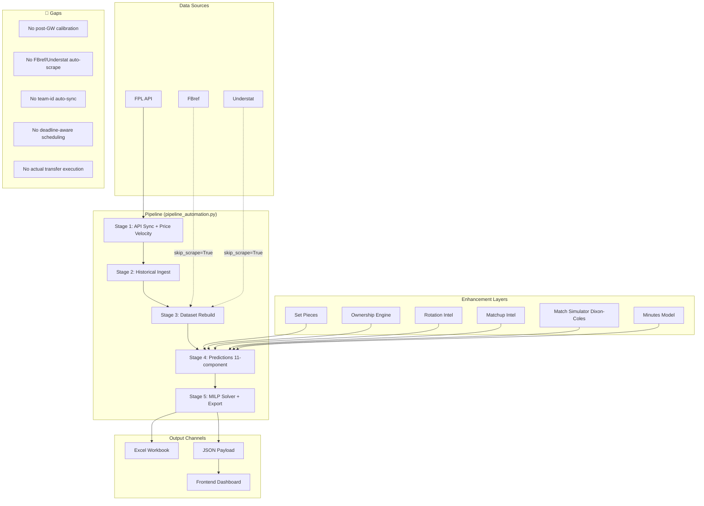

# FPL System Assessment: Current State, Workflow & Roadmap to Top 1%

## What You've Built (It's Massive)

You have a **production-grade quantitative FPL engine** that would be the envy of most FPL analytics projects. Here's the full stack:

### Backend Model Pipeline (`model/`)

| Module | What It Does | Status |
|--------|-------------|--------|
| [`build_dataset.py`](file:///E:/Fantasy-Premier-League/model/build_dataset.py) | Merges rolling form, FBref, Understat, FPL API into unified feature matrix | ✅ Complete |
| [`prediction_engine.py`](file:///E:/Fantasy-Premier-League/model/prediction_engine.py) | 11-component xP decomposition with Empirical Bayes shrinkage | ✅ Complete |
| [`fixture_engine.py`](file:///E:/Fantasy-Premier-League/model/fixture_engine.py) | Opponent/venue scaling, promoted team priors, DGW rotation decay | ✅ Complete |
| [`match_simulator.py`](file:///E:/Fantasy-Premier-League/model/match_simulator.py) | Dixon-Coles bivariate Poisson + 10K Monte Carlo per match | ✅ Complete |
| [`minutes_model.py`](file:///E:/Fantasy-Premier-League/model/minutes_model.py) | Continuous survival hazard: P(Start), P(≥60), hook risk, congestion decay | ✅ Complete |
| [`solver.py`](file:///E:/Fantasy-Premier-League/model/solver.py) | MILP squad/transfer optimizer with CVaR tail-risk, multi-GW horizon, auto-sub valuation | ✅ Complete |
| [`chip_optimizer.py`](file:///E:/Fantasy-Premier-League/model/chip_optimizer.py) | DGW/BGW scanner + optimal chip timing across season | ✅ Complete |
| [`set_pieces.py`](file:///E:/Fantasy-Premier-League/model/set_pieces.py) | PK/FK/CK taker hierarchy → xG/xA equity boosts | ✅ Complete |
| [`ownership_engine.py`](file:///E:/Fantasy-Premier-League/model/ownership_engine.py) | Top-10K EO modeling + rank_protect/differential_chase strategies | ✅ Complete |
| [`price_predictor.py`](file:///E:/Fantasy-Premier-League/model/price_predictor.py) | Transfer velocity → 5-tier price change alerts | ✅ Complete |
| [`rotation_intelligence.py`](file:///E:/Fantasy-Premier-League/model/rotation_intelligence.py) | European congestion, hook propensity, news dampening | ✅ Complete |
| [`matchup_intelligence.py`](file:///E:/Fantasy-Premier-League/model/matchup_intelligence.py) | H2H Bayesian multipliers, defensive line depth, tactical archetypes | ✅ Complete |
| [`live_sync.py`](file:///E:/Fantasy-Premier-League/model/live_sync.py) | 1-click FPL team ID ingestion, rival squad sync, FT tracking | ✅ Complete |
| [`live_manager.py`](file:///E:/Fantasy-Premier-League/model/live_manager.py) | Matchday decision cockpit: injury filter → solver → Excel/JSON export | ✅ Complete |
| [`pipeline_automation.py`](file:///E:/Fantasy-Premier-League/model/pipeline_automation.py) | 5-stage orchestrator with 4 modes (sync/full/predictions_only/solver_only) | ✅ Complete |
| [`backtester.py`](file:///E:/Fantasy-Premier-League/model/backtester.py) | 38-GW historical replay with chip automation | ✅ Complete |
| [`excel_exporter.py`](file:///E:/Fantasy-Premier-League/model/excel_exporter.py) | 5-tab professional Excel workbook | ✅ Complete |
| [`enrich_frontend_data.py`](file:///E:/Fantasy-Premier-League/model/enrich_frontend_data.py) | Dixon-Coles matrices + minutes hazard + set-piece data → frontend JSON | ✅ Complete |

### Frontend Dashboard (`frontend/`)
- **Vite + React** single-page app with 14 components
- Tactical pitch view, player DNA inspector, fixture probability drawer
- Multi-GW transfer planner, rival threat matrix, market velocity ticker
- Live team sync modal, component studio
- **Currently running** at `http://localhost:5174`

### Automation Scripts (`scripts/`)
- [`run_daily_sync.bat`](file:///E:/Fantasy-Premier-League/scripts/run_daily_sync.bat) — one-click `pipeline_automation --mode sync`
- [`setup_daily_task.ps1`](file:///E:/Fantasy-Premier-League/scripts/setup_daily_task.ps1) — Windows Task Scheduler registration (daily at 06:00 AM)

### Test Coverage
- **173+ unit tests** across the entire model package

---

## The Gameweek Workflow: What Happens When a New GW Arrives

Here's the **actual current workflow**, step by step, when transitioning from GW *N* to GW *N+1*:

### Phase 1: Data Refresh (Can Be Automated)
```
python -m model.pipeline_automation --season 2026-27 --mode sync
```
This runs 5 stages automatically:
1. **API Sync** — Pulls `players_raw.csv`, `teams.csv`, `fixtures.csv` from FPL bootstrap-static API
2. **Price Snapshot** — Records transfer velocity to `data/2026-27/price_history/<date>.csv`
3. **Dataset Rebuild** — Rebuilds `model_dataset.csv` from rolling form + underlying stats
4. **Predictions** — Generates `predictions.csv` (baseline) and `fixture_predictions_gw<N>.csv` (opponent-adjusted)
5. **Solver** — Runs MILP optimizer → `fpl_matchday_live_gw<N>.xlsx` + `.json`

### Phase 2: Frontend Update (Semi-Manual)
The JSON auto-copies to `frontend/src/data/live_matchday_gw<N>.json`, but:
- The enrichment script (`enrich_frontend_data.py`) **must be run separately** to inject Dixon-Coles matrices, minutes hazard, etc.
- Frontend is **hardcoded** to load specific GW files

### Phase 3: Decision Making (Manual)
- Open the frontend or Excel workbook
- Review starting XI, transfers, captain pick
- Cross-reference with injury news, press conferences, eye test
- **Actually make the transfers on the FPL website** — fully manual

### Phase 4: Live Sync (Semi-Manual)
```
python -m model.live_manager --season 2026-27 --gw 2 --team-id <YOUR_ID> --league-id <YOUR_LEAGUE>
```
This syncs your actual FPL team state (picks, bank, FTs) and generates the live decision cockpit.

---

## What's Already Automated ✅

| Step | Automation Level |
|------|-----------------|
| FPL API data pull | ✅ Fully automated via `pipeline_automation` |
| Price velocity tracking | ✅ Fully automated, daily snapshots |
| Feature matrix rebuild | ✅ Fully automated |
| 11-component point predictions | ✅ Fully automated |
| Fixture-adjusted projections | ✅ Fully automated |
| MILP squad optimization | ✅ Fully automated |
| Multi-GW transfer planning | ✅ Fully automated (3-5 GW horizon) |
| Chip timing recommendations | ✅ Fully automated |
| Excel report generation | ✅ Fully automated |
| JSON → frontend data | ✅ Partially automated (copies JSON, enrichment separate) |
| Daily scheduled run | ✅ Windows Task Scheduler at 06:00 AM |

---

## What's NOT Automated / Gaps 🔴

### 1. Post-GW Actual Points Ingestion & Model Calibration
> **The model never learns from its own mistakes.**

- After GW1 finishes, there's no automated process to:
  - Pull actual GW1 points for every player
  - Compare predicted xP vs actual points
  - Compute and track prediction accuracy (MAE, RMSE, calibration curves)
  - Adjust model weights or priors based on error patterns
- The `backtester.py` exists but only runs on historical seasons — it doesn't do **live season recalibration**

### 2. GW Transition is Not Seamless
- No single command says "GW1 is done, transition me to GW2"
- You have to manually:
  - Update `--gw` parameter from 1 → 2
  - Run the `full` mode pipeline to pull per-player GW histories
  - Run `enrich_frontend_data.py` separately
  - The frontend needs the correct JSON filename

### 3. No FBref/Understat Live Scraping in Pipeline
- `build_dataset` runs with `skip_scrape=True` by default in the pipeline
- FBref xG/xA and Understat underlying stats are **stale after GW1** unless manually scraped
- These are critical inputs to the prediction engine's per-90 rates

### 4. No Actual FPL Team Sync in Pipeline
- `pipeline_automation` doesn't call `live_sync.sync_manager_profile`
- Your actual squad, bank, FTs, selling prices aren't automatically fed into the solver
- You have to manually pass `--team-id`, `--bank`, `--ft` every time

### 5. No Press Conference / Injury Intelligence
- FPL's `status` and `chance_of_playing` flags update **after** press conferences (usually Friday)
- No alerting system for when these change between pipeline runs
- Top 1% managers react to pressers within hours

### 6. No Deadline Awareness
- The pipeline detects deadlines but doesn't **act on them**
- No automatic "deadline minus 2 hours" trigger for final predictions
- No escalation if you haven't confirmed your team

### 7. No Actual Transfer Execution
- The solver recommends transfers, but you manually go to the FPL website
- No API integration for making transfers (FPL doesn't have a public write API, but there are unofficial endpoints)

### 8. Frontend Data is Stale Between Runs
- `live_matchday_gw1.json` and `gw2.json` are static snapshots
- No live updating during matches
- No actual points tracker during gameday

---

## What Needs Improvement to Reach Top 1%

### Tier 1: Critical (Do This Week)

#### A. One-Command GW Transition
Build a `transition_gameweek` command that:
1. Detects that GW *N* has finished (all fixtures `finished == True`)
2. Runs `--mode full` to pull completed GW histories
3. Scrapes FBref + Understat for latest underlying stats
4. Syncs your actual team via `--team-id`
5. Generates predictions for GW *N+1*
6. Runs enrichment for frontend
7. Outputs a diff: "Here's what changed since your last run"

#### B. Actual Team State Auto-Sync
Wire `live_sync.sync_manager_profile` into `pipeline_automation.py` so the solver always uses your **real** squad, bank, selling prices, and FTs — not manually-passed defaults.

#### C. Prediction Accuracy Tracker
After each GW completes:
- Pull actual points
- Compare to predicted xP per player
- Track cumulative MAE, position-level calibration
- Flag systematic biases (e.g., "model consistently over-predicts DEF clean sheets by 0.8 pts")

### Tier 2: High Impact (This Month)

#### D. FBref/Understat Auto-Scrape in Pipeline
Remove `skip_scrape=True` as the default, or add a `--scrape` flag to `pipeline_automation`. The underlying xG/xA data is the core signal — running on stale data is like trading on yesterday's prices.

#### E. Deadline-Aware Scheduler
Instead of a fixed daily 06:00 AM run:
- Parse `deadline_time` from FPL API
- Schedule pipeline runs at: **deadline minus 24h**, **deadline minus 6h**, **deadline minus 1h**
- The last run captures final injury updates and press conference info

#### F. Price Change Alerting
The price predictor already classifies `RISING_LOCK`/`FALLING_LOCK`. Wire this to:
- Desktop notifications
- Telegram/Discord webhook
- "Act now: Salah (£13.2M) is about to rise, you own him at £13.0M → sell/hold decision needed"

#### G. Differential Strategy Engine
For top 1%, you need **effective ownership awareness**:
- Track your rank trajectory
- If you're ahead of target pace → switch to `rank_protect` (match the template)
- If you're behind → switch to `differential_chase` (go against the template)
- This strategic mode switching should be **automatic** based on rank

### Tier 3: Edge Gains (Ongoing Season)

#### H. Live Matchday Auto-Sub Optimizer
During live matches, calculate in real-time:
- "If Salah doesn't play, your auto-sub is X, giving you Y points vs template's Z"
- Helps with vice-captain pick strategy

#### I. Transfer Market Arbitrage
Use price prediction to identify:
- Players about to rise that you should buy now
- Players about to drop that you should sell before the drop
- Optimal transfer timing (early in the week vs deadline day)

#### J. Historical Bias Correction
Use the backtester results to:
- Calibrate the Empirical Bayes priors (is M₀ = 500 mins optimal?)
- Tune fixture engine multipliers (are promoted team priors accurate?)
- Adjust CVaR λ_risk parameter

---

## How I Can Help You Right Now

### Immediate Actions I Can Take:

1. **Build the one-command GW transition script** — a single `python -m model.gameweek_transition` that does everything from "GW finished" to "here's your GW+1 plan"

2. **Wire team-id auto-sync into the pipeline** — so `pipeline_automation --mode sync` always pulls your real squad

3. **Build a prediction accuracy tracker** — a post-GW script that computes and logs MAE/RMSE and tracks calibration over the season

4. **Fix the frontend data pipeline** — make enrichment automatic and make the frontend dynamically load the current GW's data instead of hardcoded filenames

5. **Build a deadline-aware smart scheduler** — replaces the fixed 06:00 AM daily run with deadline-relative triggers

6. **Set up price change alerts** — push notifications when RISING_LOCK/FALLING_LOCK players are in your squad or watchlist

7. **Run the pipeline right now for GW2** — verify everything works, generate your GW2 plan, and identify any data issues

### What I Need From You:

> [!IMPORTANT]
> To make this system truly hands-off, I need a few things:
> 1. **Your FPL Team ID** (Entry ID) — the number in your FPL URL
> 2. **Your Mini-League ID** — for rival tracking
> 3. **Which improvements from the tiers above do you want to prioritize?**
> 4. **Do you want alerts via Telegram, Discord, or just desktop notifications?**

---

## Architecture Summary


