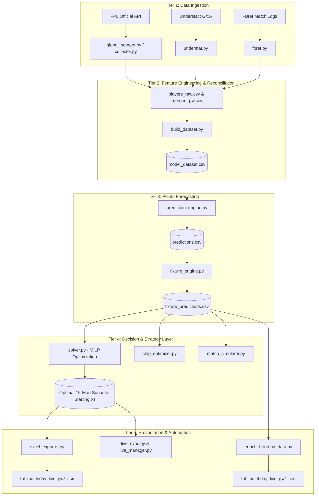

# End-to-End System Architecture

The FPL points-prediction and squad optimization platform processes data through a 5-tier architecture that transforms raw Premier League data into mathematically rigorous fantasy decision support.

---

## 5 Pipeline Tiers

### 1. Ingestion Tier ([Scrapers](/scrapers/fpl-api-pipeline.md))
- **FPL API**: Extracts `bootstrap-static`, `fixtures`, and per-player match histories into [players_raw.csv](/datasets/players-raw.md) and [merged_gw.csv](/datasets/merged-gw.md).
- **Understat**: Scrapes match-level expected goals ($xG$) and expected assists ($xA$) via [understat.py](/scrapers/understat-scraper.md).
- **FBref**: Scrapes official team sheet starts, substitution minutes, and bench cameos via [fbref.py](/scrapers/fbref-scraper.md).

### 2. Feature Engineering Tier ([Build Dataset](/computations/build-dataset.md))
- Reconciles player identities across FPL IDs, Understat IDs, and FBref text strings with Unicode normalization.
- Calculates dual-window rolling form (short-term 6 gameweeks vs long-term season-to-date) into [model_dataset.csv](/datasets/model-dataset.md).

### 3. Point-Prediction Tier ([Point Prediction](/models/point-prediction-engine.md) & [Fixture Engine](/models/fixture-and-form-engine.md))
- Computes baseline expected points across 11 discrete scoring components ($C_1 \dots C_{11}$) using Empirical Bayes shrinkage ($M_0 = 500.0\text{ mins}$) in [predictions.csv](/datasets/predictions.md).
- Adjusts baseline rates for upcoming fixtures via conjugate venue multipliers ($1.08 / 0.9259$), opponent attack/defense strengths, promoted baseline priors, and double gameweek fatigue in [fixture_predictions.csv](/datasets/fixture-predictions.md).

### 4. Mathematical Optimization Tier ([Squad Optimization Solver](/models/squad-optimization-solver.md))
- Solves a multi-gameweek lookahead Mixed-Integer Linear Program (MILP) maximizing expected starting XI points over a 3-5 gameweek horizon subject to:
  - Positional limits (2 GK, 5 DEF, 5 MID, 3 FWD) within £100.0M budget.
  - Max 3 players per Premier League club.
  - FPL 50% profit retention formula on player sales.
  - Chip scheduling ([Bench Boost, Triple Captain, Free Hit, Wildcard](/models/squad-optimization-solver.md)).

### 5. Presentation & Monitoring Tier ([Excel Exporter](/computations/export-excel.md) & [Live Sync](/computations/sync-live-gameweek.md))
- Generates formatted multi-tab Excel workbooks (`fpl_matchday_live_gw*.xlsx`).
- Emits structured JSON state payloads (`fpl_matchday_live_gw*.json`) for web UI cockpit rendering.
- Continuously tracks live matchday bonus points, auto-substitutions, and actual player points during live matches.
