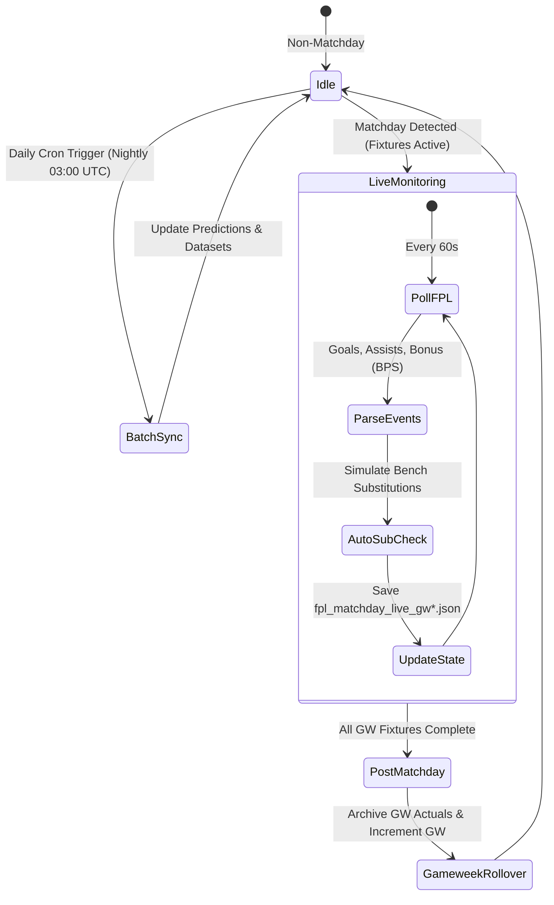

# Pipeline Automation & Live Subsystems

The analytics ecosystem supports both scheduled batch execution (pre-deadline analysis and nightly refresh) and live matchday event streaming.

---

## 1. Batch Execution Modes

Batch execution runs automatically via Windows Task Scheduler (`scripts/run_daily_sync.bat`) or manually via CLI:

1. **Scrape Refresh**: Pulls updated `players_raw.csv`, Understat match logs, and FBref statistics.
2. **Dataset Reconstruction**: Rebuilds [model_dataset.csv](/datasets/model-dataset.md) with updated dual-window rolling form.
3. **Point Projections**: Generates [predictions.csv](/datasets/predictions.md) and [fixture_predictions.csv](/datasets/fixture-predictions.md).
4. **Strategy Optimization**: Runs [solver.py](/computations/solve-squad.md) over 3-gameweek lookahead horizon and exports multi-tab Excel files.

---

## 2. Matchday Live Sync Daemon

During active Premier League fixtures, [live_sync.py](/computations/sync-live-gameweek.md) polls the official FPL live API endpoint:

- **Polling Cadence**: Configurable interval (default 60s during matches, 300s pre-kickoff).
- **Provisional Bonus Points**: Tracks live BPS (Bonus Points System) metrics and projects final bonus distribution (3, 2, 1 pts).
- **Auto-Substitution Engine**: Monitors starter minutes; if a starting player plays 0 minutes and their match concludes, the engine evaluates the bench in priority order (satisfying valid formation constraints: min 3 DEF, min 2 MID, min 1 FWD).
- **Captaincy Multipliers**: Tracks active captaincy points and automatically transfers $2\times$ multiplier to vice-captain if captain records 0 minutes.
