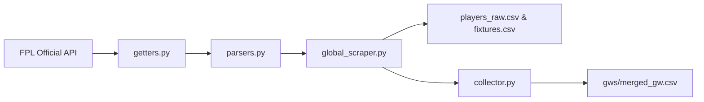

# Pipeline: Official FPL API Ingestion

The platform extracts data from official FPL JSON endpoints via four decoupled modules:

## 1. Module Responsibilities

* **[`getters.py`](../../getters.py)**: Raw HTTP calls to official FPL endpoints (`/api/bootstrap-static/`, `/api/fixtures/`, `/api/element-summary/{id}/`).
* **[`parsers.py`](../../parsers.py)**: Converts JSON payloads into standard tabular dictionaries.
* **[`global_scraper.py`](../../global_scraper.py)**: Top-level orchestration for season overview files ([players_raw.csv](/datasets/players-raw.md), [teams.csv](/datasets/teams-and-fixtures.md), [fixtures.csv](/datasets/teams-and-fixtures.md)).
* **[`collector.py`](../../collector.py)**: Merges weekly gameweek CSVs into [merged_gw.csv](/datasets/merged-gw.md).
