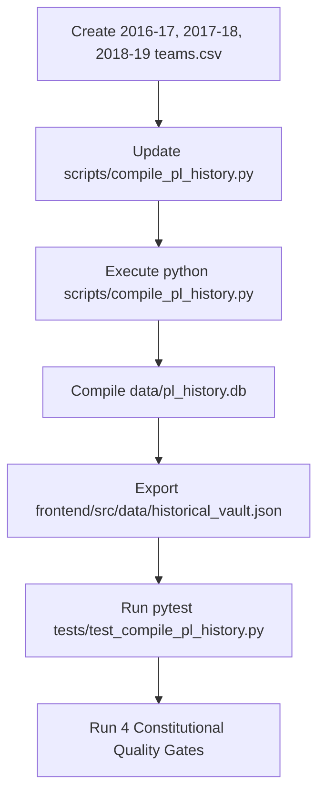

# Technical Architecture & Implementation Plan: Historical Club Assignment Fix

**Feature ID:** `001-historical-club-assignment-fix`  
**Specification Reference:** [`spec.md`](spec.md)  
**Status:** `Completed`  
**Lead Engineer / Agent:** Antigravity  
**Date:** 2026-09-11  

---

## 1. Ground Truth Team Mappings

### 1.1 FPL Permanent Global `team_code` Dictionary
In the Fantasy Premier League API, `code` is immutable across all campaigns, regardless of annual promotion or relegation:
```python
GLOBAL_TEAM_CODES = {
    1: ("Man Utd", "MUN"),
    2: ("Leeds", "LEE"),
    3: ("Arsenal", "ARS"),
    4: ("Newcastle", "NEW"),
    6: ("Spurs", "TOT"),
    7: ("Aston Villa", "AVL"),
    8: ("Chelsea", "CHE"),
    9: ("Coventry City", "COV"),
    11: ("Everton", "EVE"),
    13: ("Leicester", "LEI"),
    14: ("Liverpool", "LIV"),
    17: ("Nott'm Forest", "NFO"),
    20: ("Southampton", "SOU"),
    21: ("West Ham", "WHU"),
    25: ("Middlesbrough", "MID"),
    31: ("Crystal Palace", "CRY"),
    35: ("West Brom", "WBA"),
    36: ("Brighton", "BHA"),
    38: ("Huddersfield", "HUD"),
    39: ("Wolves", "WOL"),
    40: ("Ipswich", "IPS"),
    43: ("Man City", "MCI"),
    45: ("Norwich", "NOR"),
    49: ("Sheffield Utd", "SHU"),
    54: ("Fulham", "FUL"),
    56: ("Sunderland", "SUN"),
    57: ("Watford", "WAT"),
    80: ("Swansea", "SWA"),
    88: ("Hull City", "HUL"),
    90: ("Burnley", "BUR"),
    91: ("Bournemouth", "BOU"),
    94: ("Brentford", "BRE"),
    97: ("Cardiff", "CAR"),
    102: ("Luton", "LUT"),
    110: ("Stoke", "STK"),
}
```

### 1.2 Season-Specific Team ID Mappings ($1 \dots 20$)
Alphabetical club assignment per campaign:

#### **2016–17 Campaign**
```csv
id,code,name,short_name
1,3,Arsenal,ARS
2,91,Bournemouth,BOU
3,90,Burnley,BUR
4,8,Chelsea,CHE
5,31,Crystal Palace,CRY
6,11,Everton,EVE
7,88,Hull City,HUL
8,13,Leicester,LEI
9,14,Liverpool,LIV
10,43,Man City,MCI
11,1,Man Utd,MUN
12,25,Middlesbrough,MID
13,20,Southampton,SOU
14,110,Stoke,STK
15,56,Sunderland,SUN
16,80,Swansea,SWA
17,6,Spurs,TOT
18,57,Watford,WAT
19,35,West Brom,WBA
20,21,West Ham,WHU
```

#### **2017–18 Campaign**
*(Promoted: Brighton, Huddersfield, Newcastle; Relegated: Hull, Middlesbrough, Sunderland)*
```csv
id,code,name,short_name
1,3,Arsenal,ARS
2,91,Bournemouth,BOU
3,36,Brighton,BHA
4,90,Burnley,BUR
5,8,Chelsea,CHE
6,31,Crystal Palace,CRY
7,11,Everton,EVE
8,38,Huddersfield,HUD
9,13,Leicester,LEI
10,14,Liverpool,LIV
11,43,Man City,MCI
12,1,Man Utd,MUN
13,4,Newcastle,NEW
14,20,Southampton,SOU
15,110,Stoke,STK
16,80,Swansea,SWA
17,6,Spurs,TOT
18,57,Watford,WAT
19,35,West Brom,WBA
20,21,West Ham,WHU
```

#### **2018–19 Campaign**
*(Extracted directly from `data/2018-19/raw.json`)*
```csv
id,code,name,short_name
1,3,Arsenal,ARS
2,91,Bournemouth,BOU
3,36,Brighton,BHA
4,90,Burnley,BUR
5,97,Cardiff,CAR
6,8,Chelsea,CHE
7,31,Crystal Palace,CRY
8,11,Everton,EVE
9,54,Fulham,FUL
10,38,Huddersfield,HUD
11,13,Leicester,LEI
12,14,Liverpool,LIV
13,43,Man City,MCI
14,1,Man Utd,MUN
15,4,Newcastle,NEW
16,20,Southampton,SOU
17,6,Spurs,TOT
18,57,Watford,WAT
19,21,West Ham,WHU
20,39,Wolves,WOL
```

---

## 2. Codebase Component & File Map

### 2.1 Missing Season Teams Datasets
- `[NEW]` [`data/2016-17/teams.csv`](file:///e:/Fantasy-Premier-League/data/2016-17/teams.csv)
- `[NEW]` [`data/2017-18/teams.csv`](file:///e:/Fantasy-Premier-League/data/2017-18/teams.csv)
- `[NEW]` [`data/2018-19/teams.csv`](file:///e:/Fantasy-Premier-League/data/2018-19/teams.csv)

### 2.2 Compiler Enhancement
- `[MODIFY]` [`scripts/compile_pl_history.py`](file:///e:/Fantasy-Premier-League/scripts/compile_pl_history.py):
  1. `get_teams_map(season_dir)`:
     - Check `season_dir / "teams.csv"`.
     - Check `season_dir / "raw.json"` (`d["teams"]`).
     - Fallback to season-specific lookup or global `team_code` dictionary.
  2. Implement `export_vault_json(conn, json_path)`:
     - Automatically query `seasons_summary`, `season_dream_teams` joined with `players_seasons`, and top records (`hall_of_fame_points`, `hall_of_fame_goals`).
     - Write out atomic, formatted JSON to [`frontend/src/data/historical_vault.json`](file:///e:/Fantasy-Premier-League/frontend/src/data/historical_vault.json).

### 2.3 Unit Testing & Regression Shield
- `[MODIFY]` [`tests/test_compile_pl_history.py`](file:///e:/Fantasy-Premier-League/tests/test_compile_pl_history.py):
  - Assert Salah (2017–18 & 2018–19) has `team_name == 'Liverpool'`.
  - Assert Hazard (2018–19) has `team_name == 'Chelsea'`.
  - Assert Sterling (2017–18 & 2018–19) has `team_name == 'Man City'`.
  - Assert 0 occurrences of 'Middlesbrough' in 2018–19.

---

## 3. Execution & Verification Flow



---

## 4. Rollback & Safety
- All modifications are deterministic data pipeline updates.
- If needed, `git restore frontend/src/data/historical_vault.json data/pl_history.db` immediately restores previous state.
